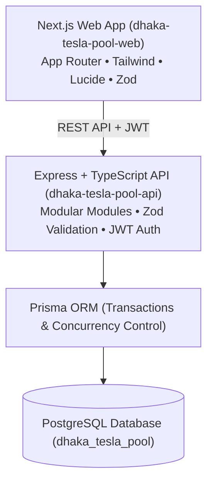

# Dhaka Tesla Pool

> *"Share a seat. Split the fare. Survive Dhaka traffic."*

Dhaka Tesla Pool is a ride-sharing MVP designed for Dhaka's traffic conditions, allowing multiple compatible passengers to pool a Tesla vehicle while strictly respecting vehicle capacity, ensuring fair transparent pricing, and managing complete ride lifecycles.

---

## Architecture Overview



---

## Tech Stack

- **Frontend**: Next.js (App Router), TypeScript, Tailwind CSS, Lucide React, React Hook Form, Zod
- **Backend**: Node.js, Express, TypeScript, JWT Authentication, Zod Validation
- **Database & ORM**: PostgreSQL, Prisma ORM
- **Testing**: Vitest, Supertest
- **Containerization**: Docker, Docker Compose

---

## Repository Structure

```text
dhaka-tesla-pool/
├── frontend/          # Next.js web application
├── backend/           # Express + TypeScript API server
├── docs/              # Architecture and ERD diagrams
├── docker-compose.yml # Docker Compose orchestration
├── .env.example       # Example environment variables
└── README.md          # Project documentation
```

---

## Getting Started

Refer to `.env.example` to set up environment variables.
Individual instructions for running backend, frontend, and tests are detailed in their respective directories.
