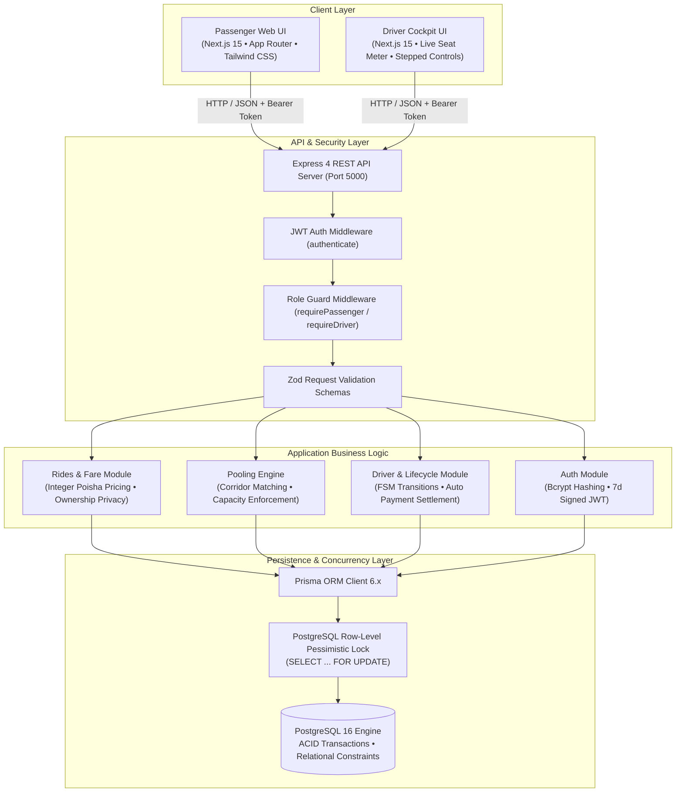
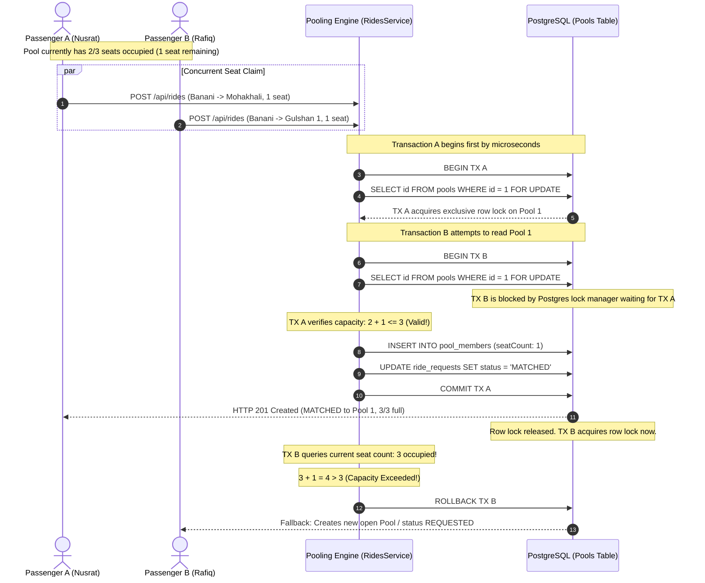
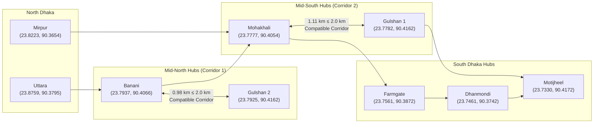

# Dhaka Tesla Pool — System Architecture

> *"Share a seat. Split the fare. Survive Dhaka traffic."*

This document provides detailed architectural specifications and Mermaid diagrams for the Dhaka Tesla Pool system.

---

## 1. High-Level System Architecture

The application is structured as a clean, production-minded modular monolith designed for predictable latency, strong concurrency control, and rapid local evaluation.



---

## 2. Ride Lifecycle Finite State Machine (FSM)

The ride lifecycle is governed by an explicit Finite State Machine enforced at the database transaction layer. Any illegal state transition is strictly rejected with HTTP 400 (`INVALID_STATUS_TRANSITION`), preventing data corruption.

```mermaid
stateDiagram-v2
    [*] --> REQUESTED: Passenger requests ride

    REQUESTED --> MATCHED: Auto-matched to active Pool / Driver accepts request
    REQUESTED --> CANCELLED: Passenger cancels while waiting

    MATCHED --> DRIVER_ARRIVED: Driver marks arrival at pickup
    MATCHED --> CANCELLED: Passenger cancels (Seats released from Pool)

    DRIVER_ARRIVED --> STARTED: Driver starts trip with onboard passengers
    DRIVER_ARRIVED --> CANCELLED: Passenger cancels before trip start

    STARTED --> COMPLETED: Driver completes trip (Fare finalized, Payment auto-generated)

    COMPLETED --> [*]
    CANCELLED --> [*]

    note right of REQUESTED: Base fare: ৳60.00\nDistance: ৳20.00/km\nPool discount: 25% (if pooled)
    note right of COMPLETED: Automatic Payment record:\nStatus: COMPLETED\nAmount: exact integer poisha
    note right of CANCELLED: Cancellation window:\nAllowed during REQUESTED, MATCHED, DRIVER_ARRIVED\nForbidden during STARTED or COMPLETED
```

### Transition Validation Table

| Current Status | Target Status | Permitted Actor | Side Effects & Invariants |
| :--- | :--- | :--- | :--- |
| **`REQUESTED`** | `MATCHED` | System / Driver | Linked to `Pool` via `PoolMember`; seat reservation incremented. |
| **`REQUESTED`** | `CANCELLED` | Passenger | Ride terminated; status history recorded. |
| **`MATCHED`** | `DRIVER_ARRIVED` | Driver | Status history recorded; passenger UI notified. |
| **`MATCHED`** | `CANCELLED` | Passenger | Seat allocation removed from Pool; remaining pool members retain trip. |
| **`DRIVER_ARRIVED`** | `STARTED` | Driver | Pool status changes to `ACTIVE`; vehicle occupied. |
| **`DRIVER_ARRIVED`** | `CANCELLED` | Passenger | Seat released; cancellation logged. |
| **`STARTED`** | `COMPLETED` | Driver | Pool status changes to `COMPLETED`; vehicle released; `Payment` record created. |
| *Any other* | *Any other* | None | **Rejected with HTTP 400 (`INVALID_STATUS_TRANSITION`)**. |

---

## 3. Concurrency & Seat Locking Architecture

The vehicle "Bullet" driven by Jashim has an absolute hard limit of **3 passenger seats**. When multiple passengers concurrently request rides that match the same pool corridor, a race condition could overbook the vehicle without locking.

To guarantee zero overbooking under high concurrency, the pooling engine executes a **PostgreSQL Row-Level Pessimistic Lock** inside an isolated Prisma transaction.



---

## 4. Dhaka Geography & Corridor Matching Engine

Dhaka's north-south transit corridors (Uttara to Motijheel) experience severe bottlenecks. The pooling engine calculates Haversine distance and groups rides whose pickup locations fall within a **2.0 km geographical tolerance**:



### Fare Formula & Integer Poisha Accounting

Floating-point representations (e.g. `0.1 + 0.2 = 0.30000000000000004`) lead to cumulative rounding errors in financial transactions. All calculations are executed and stored in integer **poisha** (1 BDT = 100 poisha):

$$\text{Distance Charge} = \text{round}(\text{distanceKm}) \times 2{,}000\text{ poisha (৳20/km)}$$
$$\text{Base Fare} = 6{,}000\text{ poisha (৳60.00)}$$
$$\text{Gross Fare} = \text{Base Fare} + \text{Distance Charge}$$
$$\text{Pool Discount} = \text{round}(\text{Gross Fare} \times 0.25)\quad (\text{if pooled})$$
$$\text{Final Fare} = \text{Gross Fare} - \text{Pool Discount}$$
