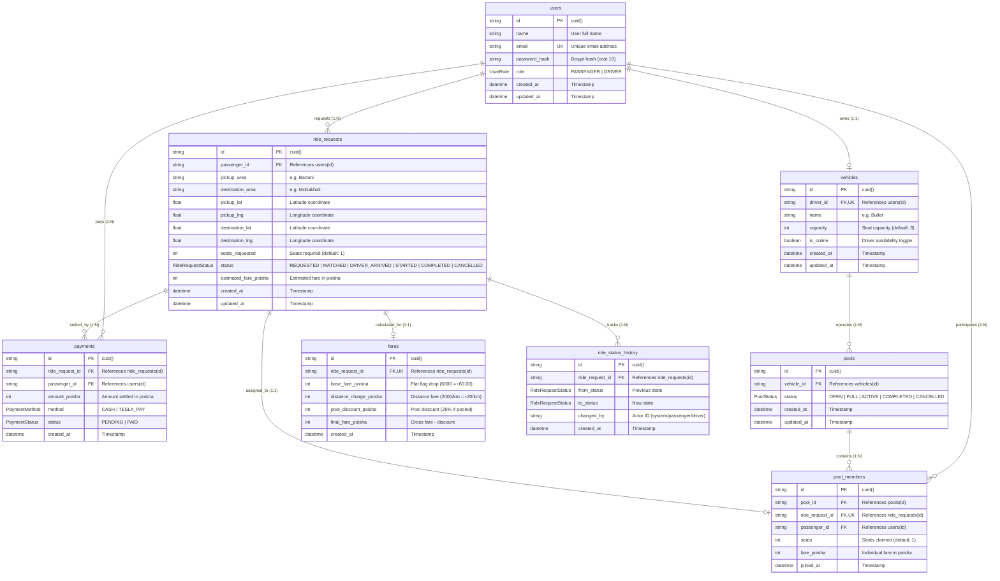

# Dhaka Tesla Pool — Entity Relationship Diagram (ERD)

> *"Share a seat. Split the fare. Survive Dhaka traffic."*

This document outlines the complete relational data model for the Dhaka Tesla Pool system, matching the active Prisma schema (`backend/prisma/schema.prisma`).

---

## 1. Visual Entity Relationship Diagram

---

## 2. Enums Definition

| Enum Name | Values | Description |
| :--- | :--- | :--- |
| **`UserRole`** | `PASSENGER`, `DRIVER` | Role-based access control guard. |
| **`RideRequestStatus`** | `REQUESTED`, `MATCHED`, `DRIVER_ARRIVED`, `STARTED`, `COMPLETED`, `CANCELLED` | Finite State Machine ride states. |
| **`PoolStatus`** | `OPEN`, `FULL`, `ACTIVE`, `COMPLETED`, `CANCELLED` | Lifecycle of a pooled vehicle trip. |
| **`PaymentMethod`** | `CASH`, `TESLA_PAY` | Accepted payment methods in Dhaka. |
| **`PaymentStatus`** | `PENDING`, `PAID` | Settlement status upon trip completion. |

---

## 3. Relational Invariants & Business Constraints

1. **Integer Poisha Financial Precision**:
   - `estimated_fare_poisha`, `base_fare_poisha`, `distance_charge_poisha`, `pool_discount_poisha`, `final_fare_poisha`, and `amount_poisha` are stored as integers representing poisha (৳1.00 = 100 poisha). No floating-point math is used.
2. **Hard Vehicle Capacity Constraint**:
   - Vehicle "Bullet" is seeded with `capacity = 3`.
   - The sum of `seats` across all active `pool_members` for a given `pool_id` must **never exceed** `vehicle.capacity`.
   - Enforced by pessimistic locking (`SELECT id FROM pools WHERE id = $1 FOR UPDATE`) within Prisma transactions.
3. **One Active Pool Membership Per Ride**:
   - `pool_members.ride_request_id` has a unique constraint (`@unique`), guaranteeing that a single ride request cannot be duplicated across multiple pools.
4. **Audit Trail Immutability**:
   - `ride_status_history` is an append-only table recording every state transition along with the triggering actor (`changed_by`).
5. **Cross-Passenger Privacy**:
   - Queries for `RideRequest`, `Fare`, and `Payment` are strictly filtered by `passengerId` so passengers can never inspect each other's fares or destinations.
